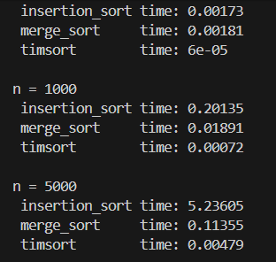

This project compares the performance of three different sorting algorithms:

Insertion Sort (O(n²))

Merge Sort (O(n log n))

Timsort — Python’s built-in sorted() (hybrid merge + insertion sort)

The purpose is to evaluate how these algorithms behave on different input sizes and confirm their theoretical time complexities using empirical measurements performed with the timeit module.

📊 Test Methodology

For each list size (n = 100, n = 1000, n = 5000):

A random list of n numbers was generated:
lst = random.sample(range(1, n+1), n)

Each algorithm was tested using:
timeit.timeit(lambda: algorithm(lst.copy()), number=1000)
.copy() ensures every algorithm receives an identical unsorted list.

All measurements were repeated 1000 times

⏱ Results

n = 100
 insertion_sort time: 0.00173
 merge_sort     time: 0.00181
 timsort        time: 6e-05

n = 1000
 insertion_sort time: 0.20135
 merge_sort     time: 0.01891
 timsort        time: 0.00072

n = 5000
 insertion_sort time: 5.23605
 merge_sort     time: 0.11355
 timsort        time: 0.00479

📌 Analysis

🔹 Insertion Sort

Works very slowly on large lists.

Time grows drastically with list size.

This matches its expected performance:

❌ Very inefficient for large data.

🔹 Merge Sort

Much faster than insertion sort.

Execution time grows more slowly.

Good for large inputs.

Stable O(n log n) complexity.

🔹 Timsort (Python built-in)

Fastest algorithm in all tests.

Outperformed both merge sort and insertion sort by a large margin.

Combines:

merge sort (good for large data)

insertion sort (good for small sorted parts)

Optimized for real-world data patterns.

🧠 Conclusion

Based on empirical results:

Insertion sort becomes unusably slow on even medium-sized lists.

Merge sort is consistently fast and handles large datasets well.

Timsort is dramatically faster than both — especially on partially sorted or structured data.

  This confirms why Python uses Timsort for sorted() and .sort():

It adapts to real-world data patterns.

It combines the strengths of merge sort and insertion sort.

It provides excellent performance in almost all scenarios.

Therefore, developers should rely on Python's built-in sorting algorithm instead of implementing manual sorting unless necessary.
